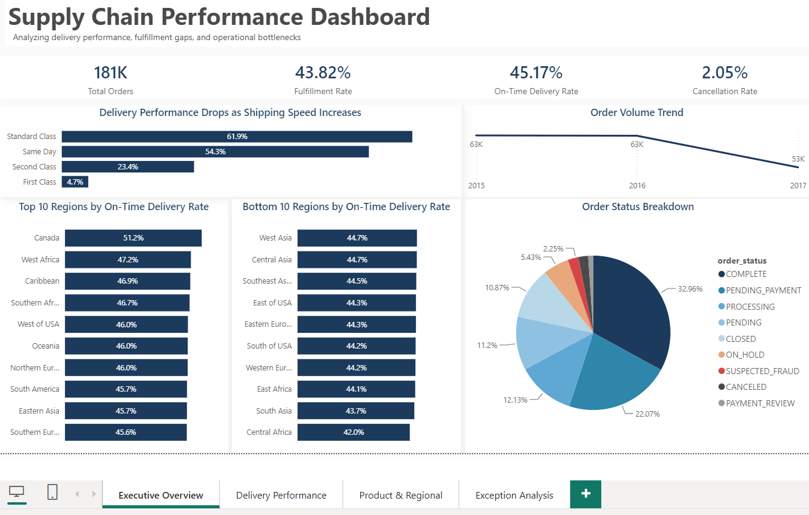
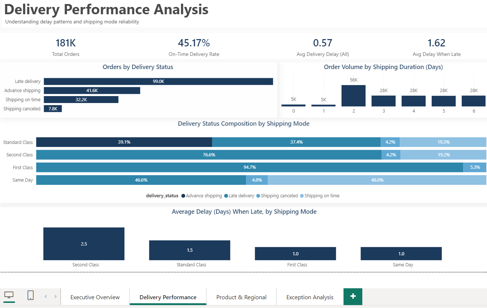
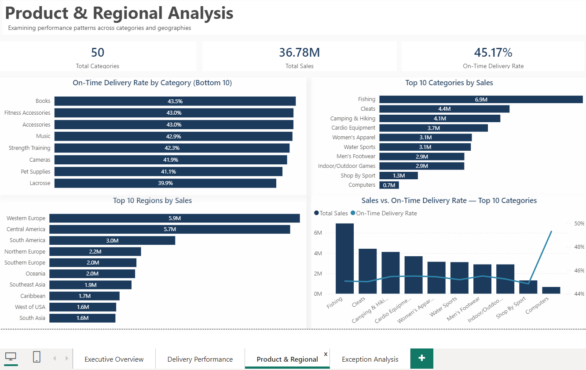
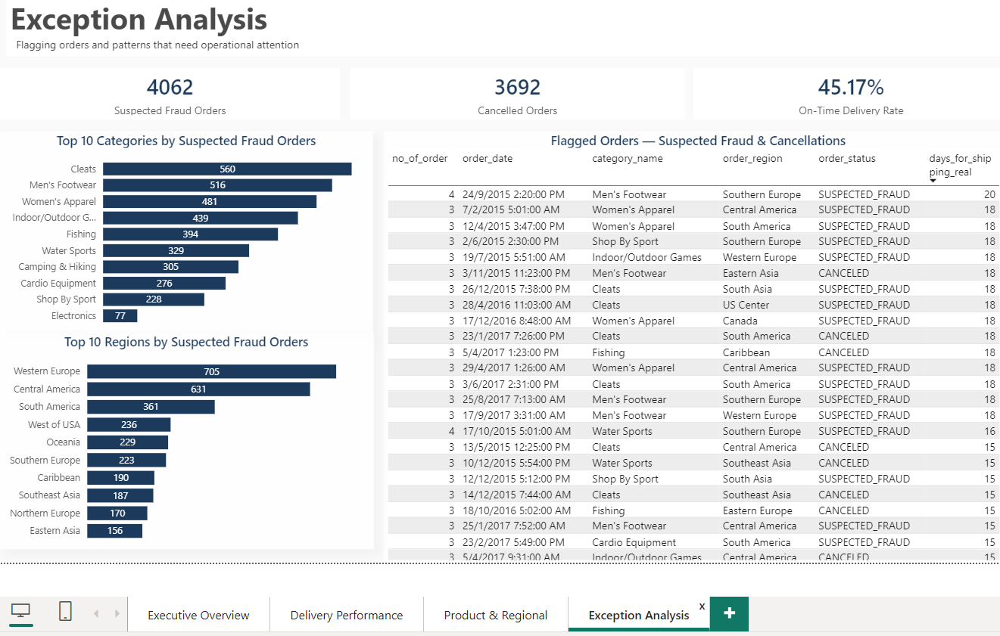

# Supply Chain Operations Analytics Dashboard

## Overview

This project analyzes supply chain operational data to identify delivery performance issues, fulfillment challenges, and operational improvement opportunities.

Using the DataCo Smart Supply Chain dataset from Kaggle, I built an end-to-end analytics workflow — from raw dataset exploration and cleaning using Python, SQL-based KPI analysis, to interactive Power BI dashboard development.

The project demonstrates how operational data can be transformed into actionable insights by analyzing delivery performance, identifying bottlenecks, and understanding the factors affecting customer order fulfillment.

**Live Dashboard:** [link once published]

**Tools Used:** Python (Pandas), SQL, Power BI, DAX, Excel

---

## Business Problem

E-commerce companies need to balance customer expectations, delivery performance, and operational efficiency.

Business teams need visibility into:

- Are customer orders being delivered on time?
- Which shipping methods are underperforming?
- What factors contribute to delivery delays?
- Are operational issues isolated to specific product categories or broader process challenges?

This project focuses on analyzing operational performance data to identify patterns, investigate delivery issues, and provide data-driven recommendations.

---

## Analytics Approach

### 1. Data Exploration & Cleaning (Python)

The raw DataCo Smart Supply Chain dataset was explored and prepared using Python and Pandas.

Data preparation activities included:

- Reviewing order, customer, product, shipping, and delivery-related fields
- Removing irrelevant or empty columns
- Standardizing column names
- Correcting date formats
- Handling data quality issues during preparation
- Performing exploratory analysis to understand dataset structure and business trends

### 2. SQL Analysis

The cleaned dataset was analyzed using SQL to calculate key operational metrics.

Analysis included:

- Order volume analysis
- Fulfillment performance
- Delivery delay calculation
- On-time delivery measurement
- Cancellation rate analysis
- Performance comparison across shipping modes
- Regional and product category analysis

### 3. Power BI Dashboard Development

The cleaned dataset was modeled and visualized in Power BI.

Dashboard development included:

- KPI calculations using DAX
- Interactive filters and drill-down analysis
- Operational performance tracking
- Exception-focused views to highlight delivery issues

---

## Dashboard Pages

| Page | Purpose |
|---|---|
| Executive Overview | Summary of order volume, fulfillment rate, delivery performance, and cancellation metrics |
| Delivery Performance Analysis | Analysis of shipping modes, delivery delays, and SLA performance |
| Product & Regional Analysis | Investigation of delivery patterns across categories and regions |
| Exception Analysis | Identification of areas requiring operational attention |

### Executive Overview


### Delivery Performance Analysis


### Product & Regional Analysis


### Exception Analysis


---

## Key Insights

### Delivery Timeliness Is the Main Operational Challenge

Only **45.17%** of orders were delivered on time, with late deliveries averaging **1.62 days behind schedule**.

The analysis indicates that the primary challenge is delivery execution and timeline management rather than order cancellation.

### Shipping Expectations May Not Match Operational Reality

On-time performance varied significantly by shipping mode:

- First Class: 4.68%
- Second Class: 23.37%
- Standard Class: 61.93%

The results suggest faster shipping commitments may not align with actual delivery capabilities.

### Delivery Issues Are Systemic Rather Than Product-Specific

On-time delivery performance across product categories remained within a narrow range of approximately 41–45%.

This indicates delivery challenges are likely related to broader logistics processes rather than specific product categories.

### Fulfillment Challenges Are Driven by Timeliness

Fulfillment rate was 43.82%, while cancellations remained low at 2.05%.

The main improvement opportunity is improving delivery reliability and operational execution.

---

## Recommendations

Based on the analysis:

### Review Shipping Commitments

Reassess promised delivery timelines for faster shipping methods to ensure customer expectations align with operational capability.

### Improve Delivery Performance Monitoring

Monitor shipping mode performance, regional trends, and delay patterns to identify operational bottlenecks earlier.

### Strengthen Exception Tracking

Create automated monitoring processes for delivery delays and operational exceptions to support faster intervention.

---

## Repository Structure

```
supply-chain-ops-dashboard/
├── python/
│   ├── explore_data.py
│   ├── clean_data.py
│   ├── load_to_sql.py
│   └── kpi_queries.py       (includes all SQL KPI queries)
├── data/
│   └── cleaned_supply_chain_data.csv
├── dashboard_screenshots/
│   ├── 01_executive_overview.png
│   ├── 02_delivery_performance.png
│   ├── 03_product_regional_analysis.png
│   └── 04_exception_analysis.png
├── Supply_Chain.pbix
└── README.md
```

---

## Future Improvements

Potential enhancements:

- Develop demand forecasting models
- Add predictive analysis for delivery delays
- Automate operational reporting
- Create additional data quality monitoring checks

---

## About This Project

This project is part of my Business Intelligence portfolio, demonstrating my ability to transform raw operational data into meaningful business insights.

The workflow covers:

**Raw Data → Data Cleaning → SQL Analysis → Power BI Dashboard → Business Recommendations**

This project complements my previous HR Analytics experience by demonstrating transferable skills in operational analytics, data cleaning, and cross-functional business intelligence.

**Connect:** [GitHub](https://github.com/joyceleehy) | [Tableau Public](https://public.tableau.com/app/profile/joyce.lee.how.yee)
